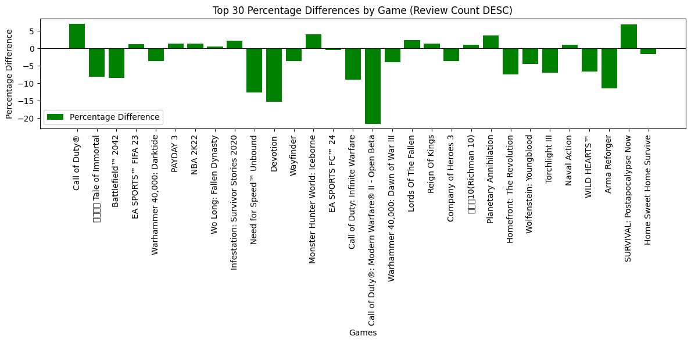

# Largest Average Distance Between Consecutive Pixel Placements
Ethan Swenke

## Idea
I made a list of ideas for this week's report to try and find something unique about the r/place 2022 data set, and the one that ended up being the most fun and informative to pursue was that of average distance between pixel placements. I wanted to find who had the most spread out placements on average, and why. I didn't initially have a clear hypothesis for what I thought would come of this analysis, but the process definitely led me to some interesting discoveries. 

## Implementation
In order to analyze this, I used duckDB and ran a series of queries on the r/place dataset to get all users placements who had a minimum of 100 placed pixels over the course of the event. This would help alleviate any outliers and give my analysis a better chance to come to a more formal conclusion. I then took this data, sorted each user's placements by their timestamps, and calculated the euclidean distance between each consecutive pixel placement. I finally took the average euclidean distance (straight line from pixel to pixel) for each user, and sorted them to find the users with the highest average distance between their pixel placements. With this filtered data, I chose to single out the top three users in order to analyze more about them and their tendencies over the course of the r/place event.

## PySpark
I attempted to run this analysis in Apache Spark, but (surpise!) I ran into some memory errors that I could not resolve. I had to give up on that approach and instead went full in on duckDB. I'm going to be standing out front during the Potions party with a bucket if anyone has any spare change for a laptop that actually works.

## Results
### Percentiles
The user with the highest distance between pixel placements had an average euclidean distance of 1379.09 pixels, with the next 2 users following closely behind with 1341.88 and 1334.70 respectively. The grid was 2000 by 2000 pixels, so the max average distance was 69% of the max axis length (nice). Here are some percentiles to get an idea of the spread of this data:
- 50th percentile: 242.93 pixels
- 75th percentile: 361.02 pixels
- 90th percentile: 468.35 pixels
- 99th percentile: 716.65 pixels

This means that the max average distance was nearly double the 99th percentile! Talk about distance.

### Colors
The next question I had was what color palette did the users with the highest average distance use? Again, I took a look at the top 3 users to see if some sort of pattern might emerge indicating the presence of a certain community, as is common in this kind of dataset. Here are some results visualized:

As we can see here, there seems to be a trend towards yellow, white, black, and a hint of blue. This is a strong indication of one specific community, rather than individual users.My initial thought was that this represented users from the German community, seeing as their flag contains yellow and black, and spans across a large portion of the canvas which could lead to pixels being placed at locations across the grid from one another within the same community. In order to confirm or deny this hypothesis, I plotted the points and colors on the grid itself to find out just where they were:

At first glance, I certainly thought I was graphing the points incorrectly, because I knew the German flag had a different location on the grid. But then I took a look at the r/place 2022 atlas to figure out what images were present. The top cluster is a long banner containing the flag of the Netherlands, along with a long, yellowish strip. Apparently, the yellow/orange strip is symbolic of the Oranje Boven (Orange Above), a well-known short song in the Netherlands (per the r/place 2022 Atlas). The following is a small strip of this banner, and within it we can see the distinct R/PLACENL, signifiying the community of the Netherlands.

In the bottom left, we can see the following images according to the cluster:

Per the Atlas, De Zeven Provinciën (The Seven Provinces) was a Dutch ship, the name referring to the seven autonomous provinces that made up the Dutch Republic in the 17th century. This ship can also be seen on the right side of the banner snippet with the flag of the Netherlands on each mast. Immediately beneath it was the The Night Watch, one of the most famous Dutch Golden Age paintings. The Dutch influence is largely tied to the community of the Netherlands because the majority of Dutch people and their descendants resided in the Netherlands. And further beneath The Night Watch and to the left is another plug to the r/placeNL reddit.

## Conclusion
The r/placeNL community held two prominent pieces of real-estate on the 2022 canvas, noteably on opposite sides of the grid. Because of this, the average consecutive pixel placement distance for these users was much larger than the majority of others. The fact that the Flag of the Netherlands spans a wide margin on the top also helps add to the average pixel distance. The flag also informs the presence of white and blue in the top colors for these users which I had mistakenly labeled as Germans prior to doing further analysis. A greyish hue was also noticable outside of the top 3-4 colors, which follows naturally from the image of De Zeven Provinciën. The yellow and black are a key component of the Oranje Boven and The Night Watch, which helps explain why my initial hypothesis was created and why it was false. Along with the fascinating cultural pieces I learned about, I found it very interesting to see my initial thoughts get completely twisted around, and if anything I believe that shows the beauty of data analysis and the importance of doing the right kinds of analysis to inform conclusions.